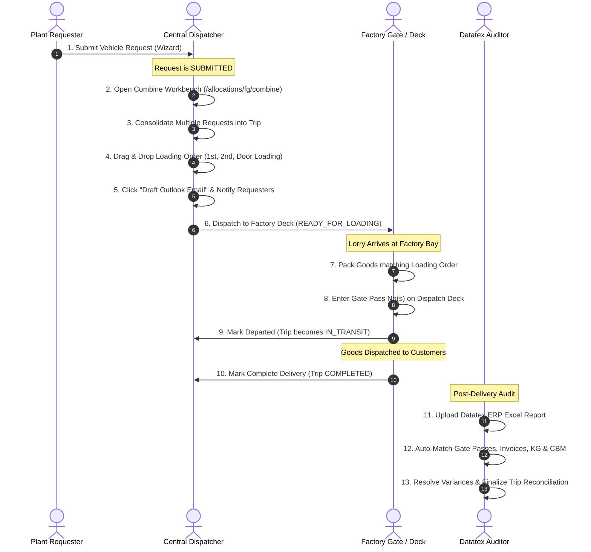

# STR-VMS: Complete A–Z Standard Operating Procedure (SOP) & Technical Reference Manual

**System Name:** STR Vehicle Management System (TMS / VMS)  
**Target Environment:** `https://str-vms.iceiy.com`  
**Application Root:** `C:\xampp\htdocs\str-vms`  
**Primary Database:** MySQL / MariaDB (`icei_42677462_str_vms` / `sql101.iceiy.com` / Local: `str_vms_utf8.sql`)  
**Document Version:** 3.0 (Enterprise Final Release)  
**Date:** September 2026  
**Audience:** Operational Users (Requesters, Dispatchers, Gate Keepers, Auditors), System Administrators, Management, and Software Engineers.

---

# Table of Contents
1. [Executive Summary & System Architecture](#1-executive-summary--system-architecture)
2. [Security, Authentication, RBAC & Scoping](#2-security-authentication-rbac--scoping)
3. [Design System, UI Tokens & Responsive Layout](#3-design-system-ui-tokens--responsive-layout)
4. [Complete Database Data Dictionary (All 26 Tables & Columns)](#4-complete-database-data-dictionary-all-26-tables--columns)
5. [Complete A–Z Feature & Page-by-Page SOP](#5-complete-a-z-feature--page-by-page-sop)
   - 5.1 [Login, Authentication & Session Security](#51-login-authentication--session-security)
   - 5.2 [Executive Dashboard](#52-executive-dashboard)
   - 5.3 [Vehicle Requests Management](#53-vehicle-requests-management)
   - 5.4 [Vehicle Allocations & Combine Workbench](#54-vehicle-allocations--combine-workbench)
   - 5.5 [Factory Dispatch Deck & Loading Gate Passes](#55-factory-dispatch-deck--loading-gate-passes)
   - 5.6 [Daily Operations Control Tower](#56-daily-operations-control-tower)
   - 5.7 [Datatex ERP Reconciliation Hub](#57-datatex-erp-reconciliation-hub)
   - 5.8 [Fleet Management (Vehicles & Drivers)](#58-fleet-management-vehicles--drivers)
   - 5.9 [Fleet Availability Dashboard](#59-fleet-availability-dashboard)
   - 5.10 [Location Master & GPS Coordinates](#510-location-master--gps-coordinates)
   - 5.11 [Route Master & Stop Sequencing](#511-route-master--stop-sequencing)
   - 5.12 [Master Data & Classifications](#512-master-data--classifications)
   - 5.13 [Monthly Fuel Rates & Indexing](#513-monthly-fuel-rates--indexing)
   - 5.14 [Executive Analytics & Financial Spend](#514-executive-analytics--financial-spend)
   - 5.15 [Live Map Geolocation](#515-live-map-geolocation)
   - 5.16 [System Settings, Users, Templates & Backups](#516-system-settings-users-templates--backups)
   - 5.17 [User Profile & Workspace Personalization](#517-user-profile--workspace-personalization)
   - 5.18 [Notifications System](#518-notifications-system)
6. [Advanced Formulas, Financial Calculations & Business Logic](#6-advanced-formulas-financial-calculations--business-logic)
7. [Step-by-Step End-to-End Operational Workflows](#7-step-by-step-end-to-end-operational-workflows)
8. [Gap Analysis & Governance (Existing, Improvements, Missing, Risks)](#8-gap-analysis--governance)
9. ["Nothing Missed" Verification Checklist](#9-nothing-missed-verification-checklist)

---

# 1. Executive Summary & System Architecture

### 1.1 Purpose
STR-VMS is an enterprise-grade Transport Management System designed for MAS Holdings / STR Logistics to handle high-frequency factory cargo transit, vehicle request dispatching, multi-drop combined trips, loading sequence optimization, factory gate pass issuance, Datatex ERP reconciliation, and automated monthly transport vendor cost billing.

### 1.2 Technical Architecture
* **Pattern**: Lightweight Model-View-Controller (Custom PHP MVC Framework).
* **Backend Runtime**: PHP 8.x running under Apache / Nginx.
* **Database Driver**: Native PHP Data Objects (`PDO`) with persistent UTF-8 mb4 encoding, prepared SQL statements, and strict transaction isolation (`BEGIN TRANSACTION`, `COMMIT`, `ROLLBACK`).
* **Frontend**: HTML5, Vanilla ES6 JavaScript, Tailwind CSS (via CDN runtime configuration), Phosphor Icons (Regular & Bold), and Leaflet.js for GIS mapping.
* **Zero External Bloat**: No heavy node build dependencies or composer vendor bloat. Native zip/XML parsing (`\app\Core\DatatexParser`) for Excel spreadsheets.
* **Entry Point**: All requests funnel through `public/index.php` via Apache `.htaccess` rewrite rules:
  ```apache
  RewriteEngine On
  RewriteCond %{REQUEST_FILENAME} !-f
  RewriteCond %{REQUEST_FILENAME} !-d
  RewriteRule ^(.*)$ index.php [QSA,L]
  ```

---

# 2. Security, Authentication, RBAC & Scoping

### 2.1 Authentication Engine (`app/Core/Auth.php`)
* **Session Tracking**: Sessions are initiated upon successful password verification using PHP `password_verify($password, $hash)` (Bcrypt).
* **Session Invalidation**: Automatic timeout enforced via `system_settings.SESSION_TIMEOUT_MINUTES` (Default: 30 minutes).
* **Heartbeat Keepalive**: Client-side JavaScript pings `POST /session/keepalive` every 5 minutes during active browser use to refresh `$_SESSION['last_activity']`.
* **Complete Logout**: Empties `$_SESSION = []`, invokes `session_unset()`, expires session cookies, and executes `session_destroy()`.

### 2.2 CSRF Auto-Protection Engine (`app/Core/Csrf.php`)
* **Token Generation**: Cryptographically secure 64-character hex tokens generated via `bin2hex(random_bytes(32))` stored in `$_SESSION['csrf_token']`.
* **Global Injection**: `app/Views/layouts/app.php` embeds a `MutationObserver` that intercepts all `<form method="POST">` elements and injects `<input type="hidden" name="csrf_token">`.
* **Global AJAX Interceptor**: The browser `window.fetch` and `XMLHttpRequest.prototype.open` are globally monkey-patched to automatically attach the `X-CSRF-Token` header and inject `csrf_token` into any `FormData` payloads.
* **Server Verification**: Handled via `Csrf::validate()`, rejecting mismatched or missing tokens with HTTP 403 Forbidden.

### 2.3 Roles & Permissions Matrix
The system provides 5 predefined enterprise roles (`roles` table):
1. **`SUPER_ADMIN` (Code 1)**: Unrestricted global access to all menus, data, financial rates, database backups, and user management.
2. **`ADMIN` (Code 2)**: Operational system administrator; manages fleet, masters, allocations, dispatch, reconciliation, and users.
3. **`POWER_USER` (Code 3)**: Dispatch Lead / Senior Planner; raises requests, allocates vehicles, manages combine trips, and views map/analytics.
4. **`ENTRY_USER` (Code 4)**: Plant-level requester; restricted strictly to raising requests and tracking their assigned plant's requests.
5. **`VIEW_USER` (Code 5)**: Executive Auditor; read-only visibility into dashboards, analytics, and tracking reports.

#### Granular Permissions (`user_permissions` table)
Users can be granted or revoked specific atomic capabilities:
* `view_dashboard`: Access executive metrics.
* `view_analytics`: Access cost analytics, spend trends, and vehicle statements.
* `create_requests`: Access the request creation wizard.
* `dispatch_trips`: Allocate vehicles, manage combine workbench, save routes, and finalize trips.
* `manage_fleet`: Add, edit, and update vehicles and drivers.
* `view_map`: View GPS map and location geocoding.
* `manage_users`: Manage system users, role assignments, and permission matrices.
* `dispatch_audit`: Access Dispatch Deck and Datatex Reconciliation hub.

### 2.4 Data Scoping & Multi-Plant Isolation
When an operational user logs in (non-admin), queries are strictly scoped:
* **Plant Scoping**: `user_plants` table links users to one or more plant IDs (`STR1`, `STR2`, `STR3`, `YD`, `CP`). The controller applies `WHERE r.plant_id IN (...)`.
* **Sub-Operation Scoping**: `user_sub_operations` limits visibility by business division (e.g. `Raw Material`, `Finished Goods`, `Dyes & Chemicals`).
* **Requester Privacy**: Non-dispatchers only view requests initiated within their authorized plants/sub-operations.

---

# 3. Design System, UI Tokens & Responsive Layout

### 3.1 Color Themes & Tokens
STR-VMS features 5 distinct enterprise UI themes switchable on the fly without page reload:
1. **Material Indigo (`material` - Default)**: Modern enterprise palette with deep navy `#1E1B4B` sidebar, indigo `#4F46E5` primary accents, and `#EEF2F7` elevated background.
2. **Enterprise Light (`light`)**: Clean corporate styling with `#0F2747` navy sidebar and `#FFFFFF` cards.
3. **Nordic Pure White (`nordic`)**: Minimalist Scandinavian design with `#18181B` sidebar, `#FFFFFF` surfaces, and subtle zinc borders.
4. **Twilight (`twilight`)**: Soft dark-slate palette with `#0F141C` sidebar, `#1E2636` cards, and `#3B82F6` blue accents.
5. **Midnight Dark (`dark`)**: Full high-contrast dark theme with `#070A10` sidebar, `#111827` cards, and `#F8FAFC` typography.

### 3.2 Typography & Iconography
* **Primary Sans Font**: `Inter` (`wght@400;500;600;700`) for all UI labels, cards, headers, and dialogs.
* **Monospace Code Font**: `JetBrains Mono` (`wght@500;600;700`) for Request Codes (`REQ-0001`), Trip Numbers (`TRIP-0001`), Gate Pass Numbers, and GPS coordinates.
* **Icon Engine**: Phosphor Icons (Regular & Bold) delivering pixel-perfect glyphs across all menus, buttons, and badges.

### 3.3 Status Colors & Badges
* **`SUBMITTED` / `PENDING`**: Amber Badge (`bg-amber-50 text-amber-700 border-amber-200`)
* **`ALLOCATED` / `ASSIGNED`**: Blue Badge (`bg-blue-50 text-blue-700 border-blue-200`)
* **`READY_FOR_LOADING`**: Purple Badge (`bg-purple-50 text-purple-700 border-purple-200`)
* **`STARTED` / `IN TRANSIT`**: Sky Blue Badge (`bg-sky-50 text-sky-700 border-sky-200`)
* **`COMPLETED`**: Emerald Green Badge (`bg-emerald-50 text-emerald-700 border-emerald-200`)
* **`CANCELLED` / `REJECTED`**: Rose Red Badge (`bg-rose-50 text-rose-700 border-rose-200`)
* **`MATCHED` (Reconciliation)**: Emerald Green (`text-emerald-600 bg-emerald-50`)
* **`VARIANCE` (Reconciliation)**: Orange Badge (`text-orange-600 bg-orange-50`)
* **`UNMATCHED`**: Red Badge (`text-red-600 bg-red-50`)

---

# 4. Complete Database Data Dictionary (All 26 Tables & Columns)

### 1. `activity_logs`
* **Purpose**: Comprehensive audit logging of user actions.
* **Columns**:
  * `id` (`INT`, PK, Auto-increment): Unique log ID.
  * `user_id` (`INT`, Required): Foreign key referencing `users.id`.
  * `action` (`VARCHAR(100)`, Required): Action verb (e.g. `LOGIN`, `CREATE_REQUEST`, `DISCARD_TRIP`, `COMPLETE_TRIP`).
  * `module` (`VARCHAR(50)`, Default `'SYSTEM'`): Functional module (e.g. `AUTH`, `ALLOCATION`, `FLEET`, `RECONCILIATION`).
  * `record_id` (`VARCHAR(50)`, Optional): Primary business identifier involved (e.g. `REQ-0012`, `TRIP-0005`).
  * `details` (`TEXT`, Optional): Extended human-readable narrative of changes.
  * `ip_address` (`VARCHAR(45)`, Default `'127.0.0.1'`): Client IPv4 or IPv6 address.
  * `created_at` (`TIMESTAMP`, Default `CURRENT_TIMESTAMP`): Event timestamp.

### 2. `audit_logs`
* **Purpose**: Low-level field-by-field change ledger tracking old vs new data values.
* **Columns**:
  * `id` (`INT`, PK, Auto-increment): Unique entry identifier.
  * `user_id` (`INT`, Optional): FK referencing `users.id`.
  * `action` (`VARCHAR(50)`, Required): Mutation type (`INSERT`, `UPDATE`, `DELETE`).
  * `module` (`VARCHAR(50)`, Required): Target entity name.
  * `record_id` (`INT`, Optional): Target database primary key.
  * `old_value` (`TEXT`, Optional): JSON serialized pre-mutation values.
  * `new_value` (`TEXT`, Optional): JSON serialized post-mutation values.
  * `ip_address` (`VARCHAR(45)`, Optional): Client IP address.
  * `created_at` (`TIMESTAMP`, Default `CURRENT_TIMESTAMP`): Mutation timestamp.

### 3. `delivery_trips`
* **Purpose**: Central trip record created when vehicles are allocated to requests.
* **Columns**:
  * `id` (`INT`, PK, Auto-increment): Internal Trip PK.
  * `trip_no` (`VARCHAR(20)`, Required, Unique): System generated identifier (e.g. `TRIP-2026-0001`).
  * `vehicle_id` (`INT`, Required): FK referencing `vehicles.id`.
  * `driver_id` (`INT`, Required): FK referencing `drivers.id`.
  * `route_id` (`INT`, Optional): FK referencing `routes.id`.
  * `planned_km` (`DECIMAL(8,2)`, Default `0.00`): Planned transit distance from selected route.
  * `actual_km` (`DECIMAL(8,2)`, Optional): Final actual odometer distance recorded after trip.
  * `payment_basis` (`VARCHAR(50)`, Optional): Payment terms (`KM_BASED` or `FIXED`).
  * `standard_cost` (`DECIMAL(10,2)`, Optional): Initial standard benchmark cost.
  * `estimated_cost` (`DECIMAL(10,2)`, Optional): Projected financial cost before transit.
  * `actual_cost` (`DECIMAL(10,2)`, Optional): Final actual cost calculated.
  * `diesel_rate_applied` (`DECIMAL(10,2)`, Optional): Diesel fuel rate (Rs/L) active during allocation.
  * `fuel_cost` (`DECIMAL(12,2)`, Optional): Calculated fuel expenditure.
  * `running_cost` (`DECIMAL(12,2)`, Optional): Vehicle maintenance & wear component.
  * `driver_profit` (`DECIMAL(12,2)`, Optional): Driver operational profit component.
  * `fixed_daily_cost` (`DECIMAL(12,2)`, Optional): Daily standing charge component.
  * `total_trip_cost` (`DECIMAL(12,2)`, Optional): Grand total trip expenditure.
  * `status` (`VARCHAR(50)`, Default `'ASSIGNED'`): Lifecycle state (`ASSIGNED`, `READY_FOR_LOADING`, `IN_TRANSIT`, `COMPLETED`, `CANCELLED`).
  * `admin_remarks` (`TEXT`, Optional): Dispatcher or management operational instructions.
  * `completed_by` (`INT`, Optional): FK referencing `users.id` who marked delivery complete.
  * `completed_at` (`DATETIME`, Optional): Exact timestamp of delivery completion.
  * `created_at`, `updated_at`: Standard automatic audit timestamps.

### 4. `drivers`
* **Purpose**: Driver profiles, licensing credentials, vehicle pairings, and operational availability.
* **Columns**:
  * `id` (`INT`, PK, Auto-increment): Driver PK.
  * `name` (`VARCHAR(100)`, Required): Driver's full legal name.
  * `nic` (`VARCHAR(20)`, Required, Unique): National Identity Card number.
  * `mobile` (`VARCHAR(20)`, Required): Contact phone number.
  * `license_number` (`VARCHAR(50)`, Required): Heavy vehicle driving license number.
  * `license_expiry` (`DATE`, Optional): Expiration date of driving license.
  * `linked_vehicle_id` (`INT`, Optional): FK to `vehicles.id` indicating dedicated primary vehicle.
  * `linked_plant_id` (`INT`, Optional): FK to `plants.id` indicating stationed home plant.
  * `status` (`ENUM('AVAILABLE','ON_TRIP','OFF_DUTY','LEAVE','INACTIVE')`, Default `'AVAILABLE'`): Operational status.
  * `remarks` (`TEXT`, Optional): Medical or disciplinary notes.
  * `active` (`TINYINT(1)`, Default `1`): Soft deletion flag (`1` = active, `0` = archived).

### 5. `locations`
* **Purpose**: Physical geographic locations (plants, warehouses, customer factories, suppliers).
* **Columns**:
  * `id` (`INT`, PK, Auto-increment): Location PK.
  * `location_name` (`VARCHAR(100)`, Required): Full entity name (e.g. `BENJI BINGIRIYA`, `STR 1 - BIYAGAMA`).
  * `display_name` (`VARCHAR(100)`, Optional): Friendly alias.
  * `code` (`VARCHAR(50)`, Optional): Customer/vendor ERP code (e.g. `ANL-V001`).
  * `business_group` (`ENUM('ELASTIC','YARN','INTERNAL')`, Default `'ELASTIC'`): Business division.
  * `location_type` (`ENUM('PLANT','WAREHOUSE','CUSTOMER','SUPPLIER','INTERNAL','OTHER')`, Required): Location classification.
  * `plant_id` (`INT`, Optional): Link to `plants.id` if this location is an internal STR plant.
  * `contact_person`, `contact_number`: On-site liaison details.
  * `latitude` (`DECIMAL(10,8)`), `longitude` (`DECIMAL(11,8)`): Exact WGS84 GPS coordinates for GIS routing.
  * `address` (`TEXT`, Optional): Full physical postal address.
  * `is_origin` (`TINYINT(1)`, Default `0`): Flag designating whether this facility can originate vehicle dispatches.
  * `active` (`TINYINT(1)`, Default `1`): Active status flag.

### 6. `mail_templates`
* **Purpose**: System email notification templates with dynamic placeholder variable interpolation.
* **Columns**:
  * `id` (`INT`, PK, Auto-increment): Template PK.
  * `template_key` (`VARCHAR(50)`, Unique): System key (`allocation_confirmed`, `dispatch_departure_notice`, `request_rejected`, `request_cancelled`).
  * `name` (`VARCHAR(100)`, Required): Friendly template title.
  * `description` (`VARCHAR(255)`, Optional): Contextual usage summary.
  * `subject` (`VARCHAR(255)`, Required): Email subject line with placeholders.
  * `body` (`TEXT`, Required): Plaintext email body template.

### 7. `master_categories`
* **Purpose**: Top-level classification groups for system master records.
* **Columns**:
  * `id` (`INT`, PK): Category PK (`1` = `SUB_OPERATION`, `2` = `VEHICLE_TYPE`).
  * `code` (`VARCHAR(50)`, Unique): Semantic code.
  * `name` (`VARCHAR(100)`, Required): Category display name.

### 8. `master_data`
* **Purpose**: Reference values for Sub-Operations and Vehicle Classification specs.
* **Columns**:
  * `id` (`INT`, PK, Auto-increment): Master datum PK.
  * `category_id` (`INT`, Required): FK referencing `master_categories.id`.
  * `code` (`VARCHAR(50)`, Required): Machine code (`RM`, `FG`, `8.5_FT`, `14.5_FT`, etc.).
  * `name` (`VARCHAR(100)`, Required): Human-readable name.
  * `default_fuel_consumption` (`DECIMAL(6,2)`): Default KM per Liter for this vehicle size.
  * `default_running_cost_per_km` (`DECIMAL(8,2)`): Maintenance cost per KM.
  * `default_profit_per_km` (`DECIMAL(10,2)`, Default `15.00`): Driver profit per KM.
  * `default_fixed_cost_per_day` (`DECIMAL(10,2)`, Default `1795.36`): Daily vehicle standing cost.
  * `sort_order` (`INT`, Default `0`): UI dropdown ordering index.
  * `active` (`TINYINT(1)`, Default `1`): Active flag.

### 9. `monthly_fuel_rates`
* **Purpose**: Monthly official diesel rate tracking used for real-time trip cost calculations.
* **Columns**:
  * `id` (`INT`, PK, Auto-increment): Fuel rate PK.
  * `period_month` (`VARCHAR(7)`, Unique): Year-Month string (format `YYYY-MM`, e.g. `'2026-09'`).
  * `diesel_rate` (`DECIMAL(10,2)`, Required): Auto diesel price per liter in Sri Lankan Rupees (LKR).
  * `is_locked` (`TINYINT(1)`, Default `0`): Freeze flag (`1` = rate locked by finance, cannot be edited).
  * `notes` (`TEXT`, Optional): Gazette or CPC circular reference remarks.

### 10. `notifications`
* **Purpose**: Real-time in-app notification center alerts.
* **Columns**:
  * `id` (`INT`, PK, Auto-increment): Notification PK.
  * `user_id` (`INT`, Optional): Target user ID (NULL if broadcast to a role).
  * `role_target` (`VARCHAR(50)`, Optional): Target role code (e.g. `'ADMIN'`, `'POWER_USER'`).
  * `plant_id` (`INT`, Optional): Filter by plant context.
  * `type` (`VARCHAR(50)`, Required): Category (`REQUEST_CREATED`, `TRIP_ALLOCATED`, `COMPLETED`, `REJECTED`).
  * `title` (`VARCHAR(255)`, Required): Headline text.
  * `message` (`TEXT`, Required): Alert narrative body.
  * `link_url` (`VARCHAR(255)`, Optional): Actionable link URL.
  * `is_read` (`TINYINT(1)`, Default `0`): Read acknowledgment indicator (`0` = unread, `1` = read).

### 11. `operations`
* **Purpose**: Primary operational divisions of STR transport.
* **Columns**:
  * `id` (`INT`, PK): Operation PK (`1` = `SHUTTLE`, `2` = `FG_OTHER`).
  * `code` (`VARCHAR(20)`, Unique): Operational code.
  * `name` (`VARCHAR(100)`, Required): Operational division title.

### 12. `plants`
* **Purpose**: Manufacturing plants and facilities operating under STR.
* **Columns**:
  * `id` (`INT`, PK, Auto-increment): Plant PK.
  * `code` (`VARCHAR(20)`, Unique): Plant short code (`STR1`, `STR2`, `STR3`, `YD`, `CP`).
  * `name` (`VARCHAR(100)`, Required): Full facility name.
  * `business_group` (`VARCHAR(50)`, Default `'ELASTIC'`): Business cluster (`ELASTIC` or `YARN`).

### 13. `roles`
* **Purpose**: User access levels.
* **Columns**:
  * `id` (`INT`, PK): Role PK (`1` to `5`).
  * `code` (`VARCHAR(20)`, Unique): Role string constant (`SUPER_ADMIN`, `ADMIN`, `POWER_USER`, `ENTRY_USER`, `VIEW_USER`).
  * `name` (`VARCHAR(50)`): Role title.
  * `description` (`TEXT`): Scope of responsibility.

### 14. `route_stops`
* **Purpose**: Intermediate and final drop-off stops along a defined route.
* **Columns**:
  * `id` (`INT`, PK, Auto-increment): Route Stop PK.
  * `route_id` (`INT`, Required): FK referencing `routes.id` (`ON DELETE CASCADE`).
  * `location_id` (`INT`, Required): FK referencing `locations.id`.
  * `stop_sequence` (`INT`, Required): Step number in sequence (`1`, `2`, `3`...).
  * `leg_distance_km` (`DECIMAL(8,2)`, Default `0.00`): Distance from the previous stop.
  * `cumulative_distance_km` (`DECIMAL(8,2)`, Default `0.00`): Total running distance from origin to this stop.
  * `estimated_time` (`INT`, Optional): Expected transit duration in minutes.
  * `active` (`TINYINT(1)`, Default `1`): Stop active flag.

### 15. `routes`
* **Purpose**: Standardized delivery routes linking origins to multi-stop destinations.
* **Columns**:
  * `id` (`INT`, PK, Auto-increment): Route PK.
  * `route_code` (`VARCHAR(50)`, Unique): Route code (e.g. `RT-STR1-HORANA`).
  * `route_name` (`VARCHAR(100)`, Required): Descriptive route title.
  * `business_group` (`ENUM('ELASTIC','YARN')`, Default `'ELASTIC'`): Division.
  * `origin_location_id` (`INT`, Required): FK referencing `locations.id` indicating start point.
  * `total_distance_km` (`DECIMAL(10,2)`): Cumulative distance across all stops.
  * `route_group` (`VARCHAR(50)`, Optional): Grouping tag.
  * `active` (`TINYINT(1)`, Default `1`): Route active indicator.
  * `remarks` (`TEXT`, Optional): Special road or route conditions.

### 16. `system_settings`
* **Purpose**: Global key-value system preferences and operational limits.
* **Columns**:
  * `id` (`INT`, PK, Auto-increment): Setting PK.
  * `setting_key` (`VARCHAR(50)`, Unique): Parameter name (`COMPANY_NAME`, `SYSTEM_NAME`, `DEFAULT_KM_RATE`, `REQUEST_PREFIX`, `TRIP_PREFIX`, `SESSION_TIMEOUT_MINUTES`, `LIMIT_REQUESTS`, `LIMIT_ALLOCATIONS`, `LIMIT_VEHICLES`, `LIMIT_DRIVERS`, `LIMIT_LOGS`).
  * `setting_value` (`TEXT`): Stored configuration value.

### 17. `trip_gate_passes`
* **Purpose**: Security gate clearance passes issued on the factory floor before vehicle departs.
* **Columns**:
  * `id` (`INT`, PK, Auto-increment): Gate Pass PK.
  * `trip_id` (`INT`, Required): FK referencing `delivery_trips.id`.
  * `request_id` (`INT`, Optional): FK referencing `vehicle_requests.id`.
  * `gate_pass_no` (`VARCHAR(100)`, Required): Physical Gate Pass / Delivery Note serial number.
  * `remarks` (`TEXT`, Optional): Gate officer notes.
  * `entered_by` (`INT`, Optional): FK to `users.id`.
  * `status` (`ENUM('ENTERED','RECONCILED','CANCELLED')`, Default `'ENTERED'`): State.

### 18. `trip_reconciliations`
* **Purpose**: ERP audit ledger comparing planned dispatch vs Datatex actual invoice metrics.
* **Columns**:
  * `id` (`INT`, PK, Auto-increment): Ledger PK.
  * `trip_id` (`INT`, Required): FK referencing `delivery_trips.id`.
  * `gate_pass_no` (`VARCHAR(100)`, Required): Datatex Gate Pass number.
  * `actual_vehicle_no` (`VARCHAR(50)`): Vehicle number recorded in Datatex.
  * `actual_boxes` (`INT`, Default `0`): Box count dispatched.
  * `actual_kg` (`DECIMAL(10,3)`, Default `0.000`): Actual net cargo weight.
  * `actual_cbm` (`DECIMAL(10,4)`, Default `0.0000`): Actual volume cubic meters.
  * `invoice_numbers` (`TEXT`): Associated commercial invoice serials.
  * `customer_name` (`VARCHAR(255)`): Buyer name from Datatex.
  * `delivery_address` (`TEXT`): Destination address from Datatex.
  * `dispatched_date` (`VARCHAR(50)`): Dispatch date in Datatex.
  * `match_status` (`ENUM('MATCHED','VARIANCE','MANUAL_OVERRIDE','UNMATCHED')`, Default `'MATCHED'`): Audit outcome.
  * `variance_remarks` (`TEXT`, Optional): Explanation for discrepancies.
  * `reconciled_by` (`INT`, Optional): User ID of the auditor.
  * `reconciled_at` (`DATETIME`, Default `CURRENT_TIMESTAMP`): Audit completion timestamp.

### 19. `trip_requests`
* **Purpose**: Many-to-Many junction table linking vehicle requests to a delivery trip, including vehicle loading sequence.
* **Columns**:
  * `trip_id` (`INT`, Required): FK referencing `delivery_trips.id` (`ON DELETE CASCADE`).
  * `request_id` (`INT`, Required): FK referencing `vehicle_requests.id` (`ON DELETE CASCADE`).
  * `loading_sequence` (`INT`, Default `1`): The physical sequence order of loading this cargo inside the lorry container.
  * **Primary Key**: Composite `(trip_id, request_id)`.

### 20. `user_operations`
* **Purpose**: Maps users to authorized operating divisions (`SHUTTLE`, `FG_OTHER`).
* **Columns**:
  * `user_id` (`INT`, Required): FK to `users.id` (`ON DELETE CASCADE`).
  * `operation_id` (`INT`, Required): FK to `operations.id` (`ON DELETE CASCADE`).
  * **Primary Key**: Composite `(user_id, operation_id)`.

### 21. `user_permissions`
* **Purpose**: Explicit granular permissions overriding role defaults for specific users.
* **Columns**:
  * `id` (`INT`, PK, Auto-increment): Permission PK.
  * `user_id` (`INT`, Required): FK to `users.id` (`ON DELETE CASCADE`).
  * `permission_key` (`VARCHAR(64)`, Required): Permission string token.
  * **Unique Key**: `(user_id, permission_key)`.

### 22. `user_plants`
* **Purpose**: Maps users to authorized factory plants for strict row-level security.
* **Columns**:
  * `user_id` (`INT`, Required): FK to `users.id` (`ON DELETE CASCADE`).
  * `plant_id` (`INT`, Required): FK to `plants.id` (`ON DELETE CASCADE`).
  * **Primary Key**: Composite `(user_id, plant_id)`.

### 23. `user_sub_operations`
* **Purpose**: Maps users to authorized sub-operation categories (`Raw Material`, `Finished Goods`, etc.).
* **Columns**:
  * `user_id` (`INT`, Required): FK to `users.id`.
  * `sub_operation_id` (`INT`, Required): FK to `master_data.id`.
  * **Primary Key**: Composite `(user_id, sub_operation_id)`.

### 24. `users`
* **Purpose**: User credentials, role assignments, UI theme preferences, and sidebar layout settings.
* **Columns**:
  * `id` (`INT`, PK, Auto-increment): User PK.
  * `user_code` (`VARCHAR(50)`, Unique): Employee ID (e.g. `USR-0001`).
  * `name` (`VARCHAR(100)`, Required): Full name.
  * `email` (`VARCHAR(100)`, Required, Unique): Corporate login email.
  * `password` (`VARCHAR(255)`, Required): Bcrypt hashed password.
  * `role_id` (`INT`, Required): FK referencing `roles.id`.
  * `theme_preference` (`VARCHAR(30)`, Default `'material'`): UI theme mode (`material`, `light`, `dark`, `nordic`, `twilight`).
  * `sidebar_hidden_items` (`TEXT`, Optional): JSON array of hidden sidebar navigation tokens.
  * `active` (`TINYINT(1)`, Default `1`): Account status (`1` = active, `0` = disabled).

### 25. `vehicle_requests`
* **Purpose**: Transport requests created by plants requiring vehicle allocation.
* **Columns**:
  * `id` (`INT`, PK, Auto-increment): Request PK.
  * `request_code` (`VARCHAR(20)`, Required, Unique): Formatted code (e.g. `REQ-2026-0042`).
  * `requester_id` (`INT`, Required): FK referencing `users.id`.
  * `plant_id` (`INT`, Required): FK referencing `plants.id`.
  * `operation_id` (`INT`, Required): FK referencing `operations.id`.
  * `sub_operation_id` (`INT`, Optional): FK referencing `master_data.id`.
  * `request_type` (`VARCHAR(50)`, Optional): Cargo type tag.
  * `from_location_id` (`INT`, Required): Pickup point FK referencing `locations.id`.
  * `to_location_id` (`INT`, Required): Drop-off point FK referencing `locations.id`.
  * `route_id` (`INT`, Optional): Suggested or matched route FK referencing `routes.id`.
  * `planned_distance_km` (`DECIMAL(8,2)`, Optional): Distance benchmark.
  * `contact_person`, `contact_phone`: Origin loading bay contact info.
  * `item_description` (`TEXT`, Required): Details of cargo (e.g. "Knitted Elastics in Cartons").
  * `quantity` (`DECIMAL(10,2)`), `unit` (`VARCHAR(20)`): Cargo quantity and measure unit (e.g. Meters, Yards, Rolls).
  * `box_count` (`INT`, Optional): Total number of physical cartons/boxes.
  * `required_kg` (`DECIMAL(10,2)`, Optional): Total gross weight in Kilograms.
  * `required_cbm` (`DECIMAL(10,2)`, Optional): Total volume in Cubic Meters.
  * `vehicle_type_id` (`INT`, Optional): Requested vehicle size FK referencing `master_data.id`.
  * `required_date` (`DATE`, Required): Target dispatch date.
  * `required_time` (`TIME`, Required): Target departure time.
  * `goods_ready_status` (`VARCHAR(50)`, Optional): State of preparation at warehouse.
  * `urgency` (`ENUM('Normal','Urgent','Critical')`, Default `'Normal'`): Priority flag.
  * `remarks` (`TEXT`, Optional): Special handling or gate instructions.
  * `invoice_numbers` (`TEXT`, Optional): Comma or newline separated commercial invoice serial numbers.
  * `status` (`ENUM('DRAFT','SUBMITTED','UNDER REVIEW','ALLOCATED','TRIP ASSIGNED','STARTED','IN TRANSIT','COMPLETED','CANCELLED','REJECTED')`, Default `'SUBMITTED'`): Lifecycle stage.

### 26. `vehicles`
* **Purpose**: Vehicle profiles, registration numbers, carrying capacities, and cost modeling parameters.
* **Columns**:
  * `id` (`INT`, PK, Auto-increment): Vehicle PK.
  * `vehicle_number` (`VARCHAR(20)`, Required, Unique): License plate (e.g. `PY-3548`, `GE-5975`).
  * `vehicle_type` (`VARCHAR(50)`, Required): Container size classification (`8.5 ft`, `10.5 ft`, `14.5 ft`, `20 ft`).
  * `operation_category_id` (`INT`, Optional): Primary operation FK referencing `operations.id`.
  * `max_payload_kg` (`DECIMAL(10,2)`, Optional): Maximum legal carrying capacity in KG.
  * `max_volume_cbm` (`DECIMAL(10,2)`, Optional): Maximum volumetric capacity in CBM.
  * `default_location_id` (`INT`, Optional): Home base location FK referencing `locations.id`.
  * `payment_basis` (`ENUM('FIXED','KM_BASED')`, Default `'KM_BASED'`): Vendor billing contract type.
  * `monthly_km_limit` (`INT`, Optional): Included monthly mileage for fixed fleet vehicles (e.g. `3000` KM).
  * `status` (`ENUM('AVAILABLE','ALLOCATED','IN_TRIP','MAINTENANCE','INACTIVE')`, Default `'AVAILABLE'`): Operational availability.
  * `fuel_consumption_kml` (`DECIMAL(6,2)`, Default `10.00`): Fuel efficiency in KM per Liter.
  * `running_cost_per_km` (`DECIMAL(8,2)`, Default `20.50`): Wear and maintenance cost per KM in LKR.
  * `profit_per_km` (`DECIMAL(8,2)`, Default `15.00`): Driver profit margin per KM in LKR.
  * `fixed_cost_per_day` (`DECIMAL(10,2)`, Default `1795.36`): Daily vehicle standing cost in LKR.
  * `monthly_fixed_rate` (`DECIMAL(12,2)`, Default `0.00`): Monthly lump-sum contract amount for fixed fleet vehicles.
  * `extra_km_rate` (`DECIMAL(8,2)`, Default `0.00`): Surcharge per kilometer exceeding `monthly_km_limit`.
  * `active` (`TINYINT(1)`, Default `1`): Active fleet status flag.

---

# 5. Complete A–Z Feature & Page-by-Page SOP

---

## 5.1 Login, Authentication & Session Security
* **URL**: `/login`, `/logout`, `/session/keepalive`
* **Controller**: [`app/Controllers/AuthController.php`](file:///c:/xampp/htdocs/str-vms/app/Controllers/AuthController.php)
* **View**: `app/Views/auth/login.php`

#### 1. What it is
The secure entry portal where users provide email credentials to authenticate and receive an active user session.

#### 2. Why it is used
To protect company transport data, enforce role-based access control, and isolate plant requests based on authenticated identity.

#### 3. How it works
1. User enters Email and Password and submits form.
2. System checks `users` table for `email = ?` and `active = 1`.
3. `password_verify($password, $user['password'])` evaluates the Bcrypt hash.
4. If verified, session variables are initialized (`$_SESSION['user_id']`, `$_SESSION['user_role']`, `$_SESSION['user_plants']`, `$_SESSION['user_sub_operations']`, `$_SESSION['user_permissions']`).
5. An audit entry is recorded in `activity_logs` with the client IP.
6. The user is redirected to `/dashboard` (if authorized) or `/requests`.

#### 4. Form Fields & Validations
* `email`: Required, valid email format.
* `password`: Required, minimum length validation.
* `csrf_token`: Injected automatically and verified on POST.

#### 5. Errors & Exceptions
* `Invalid credentials`: Triggers red warning alert and redirects back to `/login`.
* `Account inactive`: Rejects login if `active = 0`.
* `Session Expired`: Handled by `Auth::check()`; if `$_SESSION['last_activity']` exceeds `SESSION_TIMEOUT_MINUTES`, destroys session and redirects to `/login?timeout=1`.

---

## 5.2 Executive Dashboard
* **URL**: `/dashboard`, `/`
* **Controller**: [`app/Controllers/DashboardController.php`](file:///c:/xampp/htdocs/str-vms/app/Controllers/DashboardController.php)
* **View**: `app/Views/dashboard/index.php`

#### 1. What it is
The central control center displaying real-time transport KPIs, demand charts, unallocated load metrics, and fleet utilization.

#### 2. Key Metrics & Widgets
* **Total Active Requests**: Number of requests with status `SUBMITTED`, `ALLOCATED`, `STARTED`, or `IN TRANSIT`.
* **Total Dispatched Trips**: Count of trips with status `READY_FOR_LOADING`, `IN_TRANSIT`, or `COMPLETED`.
* **Total Distance Traveled**: Sum of `COALESCE(NULLIF(actual_km, 0), planned_km, 0)` across active/completed trips.
* **Estimated Spend**: Combined spend tracking:
  $$\text{Spend} = \sum (\text{KM-Based Trip Costs}) + \sum (\text{Fixed Fleet Monthly Base Rents})$$
* **Recent Requests Table**: Quick-action list of the 10 newest requests with direct links to view details.
* **Unallocated Cargo Queue**: Highlights high-priority and urgent requests requiring vehicle assignment.

#### 3. Access
Requires `Auth::can('view_dashboard')` (Super Admin, Admin, Power User, View User).

---

## 5.3 Vehicle Requests Management
* **URLs**:
  * `/requests`: Master list of all requests.
  * `/requests/create`: Step 1 of Request Wizard (Select Operation: FG & Other vs Shuttle).
  * `/requests/create/fg/plant`: Step 2A (Select Origin Plant).
  * `/requests/create/fg/sub-operation`: Step 2B (Select Sub-Operation Division).
  * `/requests/create/fg/form`: Step 3 (Final Cargo & Delivery Details Form).
  * `/requests/create/shuttle`: Shuttle Request Form.
  * `/requests/view/{id}`: Comprehensive request detail view.
  * `/requests/edit/{id}`: Request modification form.
  * `/requests/rejection-draft/{id}`: Draft email rejection text generator.
  * `/requests/reject/{id}`: Action endpoint to reject request with remarks.
  * `/requests/cancel/{id}`: Action endpoint to cancel request with remarks.
* **Controller**: [`app/Controllers/RequestController.php`](file:///c:/xampp/htdocs/str-vms/app/Controllers/RequestController.php)
* **Views**: `app/Views/requests/index.php`, `create_select.php`, `create_fg_plant.php`, `create_fg_sub_operation.php`, `create_fg_form.php`, `create_shuttle.php`, `view.php`, `edit.php`.

### 5.3.1 Request Creation Wizard (3-Step Guided Flow)
1. **Step 1 (`/requests/create`)**:
   * User chooses between **Finished Goods & Other (`FG_OTHER`)** or **Internal Shuttle (`SHUTTLE`)**.
2. **Step 2A (`/requests/create/fg/plant`)**:
   * User selects the originating plant (`STR1 - Biyagama`, `STR2 - Mt Lavinia`, `STR3 - Millaniya`, `YD`, `CP`).
   * Scoped dynamically based on `Auth::userPlantIds()`.
3. **Step 2B (`/requests/create/fg/sub-operation`)**:
   * User picks the operational category (`Finished Goods`, `Raw Material`, `Dyes & Chemicals`, `Machinery`, `Maintenance`, `Greige`, `Sample`, `Other`).
   * Scoped dynamically based on `Auth::userSubOpIds()`.
4. **Step 3 (`/requests/create/fg/form`)**:
   * **Pickup Location**: Selects from origin locations linked to the selected plant.
   * **Delivery Destination (`to_location_id`)**: Selects customer factory, warehouse, or supplier.
   * **Required Date & Time**: Target dispatch deadline.
   * **Cargo Weight (`required_kg`) & Volume (`required_cbm`)**: Used for vehicle capacity checks and fair cost share calculations.
   * **Box Count (`box_count`)**: Total carton boxes.
   * **Invoice Number(s) (`invoice_numbers`)**: Text input accepting single or multiple invoice numbers separated by commas or newlines.
   * **Urgency**: `Normal`, `Urgent`, or `Critical`.
   * **Item Description**: Detailed cargo particulars.

### 5.3.2 Request Modification & Cancellation Rules
* **Edit (`/requests/edit/{id}`)**: Allowed only while request is in `SUBMITTED`, `UNDER REVIEW`, or `DRAFT` status. Once `ALLOCATED` or `IN TRANSIT`, modification is locked to protect logistics integrity.
* **Deletion (`/requests/delete/{id}`)**: Soft or hard deletion is strictly blocked if the request has been allocated to a trip (`dt.status != 'CANCELLED'`).
* **Cancellation (`POST /requests/cancel/{id}`)**: Allowed by the requester with mandatory cancellation remarks; updates status to `CANCELLED` and notifies dispatchers.
* **Rejection (`POST /requests/reject/{id}`)**: Dispatchers can reject an unfulfillable request. Clicking "Reject" generates a pre-formatted email draft explaining the rejection reason to the requester.

---

## 5.4 Vehicle Allocations & Combine Workbench
* **URLs**:
  * `/allocations/fg`: Single Request Direct Allocation List.
  * `/allocations/fg/combine`: Master list of Combine Trips and unassigned requests queue.
  * `/allocations/fg/combine/view/{id}`: **The Combine Allocation Workbench**.
  * `POST /allocations/fg/allocate`: Assigns a single request to a dedicated vehicle.
  * `POST /allocations/fg/combine/create-empty`: Creates an empty combine trip container.
  * `POST /allocations/fg/combine/save-allocation`: Saves route and request assignments to a trip.
  * `POST /allocations/fg/combine/reorder-requests`: Reorders container loading sequence.
  * `POST /allocations/fg/combine/transfer-request`: Transfers a request from one trip to another.
  * `GET /allocations/fg/combine/discard/{id}`: Discards an unconfirmed combine trip.
  * `POST /allocations/fg/combine/complete-trip`: Finalizes delivery and closes trip.
* **Controller**: [`app/Controllers/FgOtherAllocationController.php`](file:///c:/xampp/htdocs/str-vms/app/Controllers/FgOtherAllocationController.php)
* **Views**: `app/Views/allocations/fg_index.php`, `fg_combine.php`, `fg_combine_view.php`.

### 5.4.1 Combine Allocation Workbench Workflow
The Combine Workbench is the central operational tool for dispatch planners to consolidate multiple smaller customer deliveries into a single truck:
1. **Left Panel: Add Requests Queue (`#availableRequestsTbody`)**:
   * Shows pending requests (`status = 'SUBMITTED'`) sharing compatible delivery corridors.
   * Displays Plant, From $\rightarrow$ To, CBM, and KG.
   * Clicking **"+ Add"** moves the request into the trip's assigned container.
2. **Right Panel: Included Requests (`#includedRequestsTbody`)**:
   * Displays all requests currently assigned to this truck.
   * Displays Customer Code, Invoice Numbers, Cargo Weight/Volume, and Loading Order.
3. **Interactive Drag-and-Drop Loading Sequence**:
   * Dispatchers can drag any row up or down to set the physical packing sequence.
   * **Dynamic Loading Position Rules**:
     * The very last item in the list is automatically labeled **`Door Loading`** (the final cargo loaded at the truck door, hence the first offloaded).
     * The first item is labeled **`1st Loading`** (packed deepest into the container).
     * Subsequent items are labeled **`2nd Loading`**, **`3rd Loading`**, etc.
   * **Auto-Save**: Dragging and dropping triggers an immediate background AJAX call to `POST /allocations/fg/combine/reorder-requests`, updating `trip_requests.loading_sequence` without page reload.
   * **Route Independence**: Reordering cargo loading sequence **does not modify or corrupt the geographic Route Stops** in Route Master.
4. **Consolidation Cost Savings Calculator**:
   * Real-time financial card comparing the standalone cost of running each request separately against the actual combined trip cost:
     $$\text{Net Savings} = \sum (\text{Standalone Costs}) - \text{Actual Combined Trip Cost}$$
5. **Draft Outlook Email Button**:
   * Compiles an executive dispatch advisory formatted with:
     * Requesters' emails populated into `To:`.
     * Detailed loading order breakdown (`1st Loading`, `2nd Loading`, ... `Door Loading`).
     * Commercial Invoice numbers per request.
     * Assigned driver, phone number, vehicle number, and route name.
   * Opens the user's desktop Outlook or mail client via `mailto:` with pre-populated content.
6. **Transfer Request Modal**:
   * Allows dispatchers to move an individual request from this trip directly into another active trip without unassigning and searching again.
7. **Safe Discard (`/discard/{id}`)**:
   * Reverts all allocated requests back to `SUBMITTED`.
   * Cascades cleanup by deleting unfinalized gate passes and reconciliation stubs.
   * Releases vehicle and driver back to `AVAILABLE`.
   * Deletes the unconfirmed `delivery_trips` record cleanly.
8. **Dispatch to Factory Deck**:
   * Advances trip status from `ASSIGNED` to `READY_FOR_LOADING`, transferring operational control to the factory floor gate-pass team.

---

## 5.5 Factory Dispatch Deck & Loading Gate Passes
* **URL**: `/dispatch/deck`
* **Controller**: [`app/Controllers/DispatchController.php`](file:///c:/xampp/htdocs/str-vms/app/Controllers/DispatchController.php)
* **View**: `app/Views/dispatch/deck.php`

#### 1. What it is
The warehouse and factory floor loading interface used by security and loading bay supervisors.

#### 2. How it works
1. Displays all vehicles marked `READY_FOR_LOADING` or `ASSIGNED`.
2. When physical packing matches the loading order, the officer clicks **"Enter Gate Pass"**.
3. A modal opens allowing input of the physical **Gate Pass / Delivery Note serial number** for each allocated request.
4. Submitting `POST /dispatch/save-gate-pass` records the gate passes in `trip_gate_passes`.
5. Once all gate passes are entered, clicking **"Mark Departed"** transitions the trip status to `IN_TRANSIT` and updates driver status to `ON_TRIP`.

---

## 5.6 Daily Operations Control Tower
* **URL**: `/dispatch/daily-summary`
* **Controller**: [`app/Controllers/DispatchController.php`](file:///c:/xampp/htdocs/str-vms/app/Controllers/DispatchController.php)
* **View**: `app/Views/dispatch/daily_summary.php`

#### 1. What it is
The centralized operational overview providing logistics managers with plant-by-plant dispatch tracking, vehicle allocation status, and unallocated demand queues for any selected operational date.

#### 2. Key Capabilities
* **Plant Filter & Date Picker**: Switch between plants (`STR1`, `STR2`, `STR3`, `YD`, `CP`) and dates.
* **Unallocated Demand Queue**: Real-time count of pending cargo awaiting assignment.
* **Active Trip Progress**: Live breakdown of vehicles loading, departed, and delivered.

---

## 5.7 Datatex ERP Reconciliation Hub
* **URL**: `/reconciliation`
* **Controller**: [`app/Controllers/ReconciliationController.php`](file:///c:/xampp/htdocs/str-vms/app/Controllers/ReconciliationController.php)
* **View**: `app/Views/reconciliation/index.php`
* **Parser Engine**: [`app/Core/DatatexParser.php`](file:///c:/xampp/htdocs/str-vms/app/Core/DatatexParser.php)

#### 1. What it is
The post-delivery audit portal that imports official ERP dispatch spreadsheets exported from Datatex and automatically matches them against VMS trip records.

#### 2. How it works
1. Auditor uploads the Datatex Excel (`.xlsx`) or `.csv` export file.
2. `DatatexParser` parses XML shared strings and sheet data without external dependencies:
   * Identifies the header row dynamically by matching columns (`Main Gate entry No`, `Vehicle Number`, `Invoice No`, `Dispatch Qty (KG)`, `Total Container Count`, `Max. CBM`).
   * Aggregates line items by Gate Pass number.
3. System matches uploaded gate passes against `trip_gate_passes`:
   * **`MATCHED`**: Weight, boxes, and CBM match within acceptable tolerances ($\pm 5\%$).
   * **`VARIANCE`**: Discrepancies detected between planned cargo and actual Datatex dispatch values.
   * **`UNMATCHED`**: Gate pass recorded in Datatex but not found in VMS, or vice versa.
4. **Manual Variance Override**: Auditors can click "Override Variance", enter explanatory remarks, and force-approve the record.
5. **Finalize Trip (`POST /reconciliation/finalize-trip`)**: Commits audited figures (`actual_kg`, `actual_cbm`, `actual_boxes`, `invoice_numbers`) into `trip_reconciliations` and marks trip as fully reconciled.

---

## 5.8 Fleet Management (Vehicles & Drivers)
* **URLs**:
  * `/fleet/vehicles`: Master vehicle registry.
  * `/fleet/vehicles/create`: Add new vehicle.
  * `/fleet/vehicles/edit/{id}`: Edit vehicle profile and financial parameters.
  * `/fleet/drivers`: Master driver registry.
  * `/fleet/drivers/create`: Add new driver.
  * `/fleet/drivers/edit/{id}`: Edit driver profile and license details.
* **Controller**: [`app/Controllers/FleetController.php`](file:///c:/xampp/htdocs/str-vms/app/Controllers/FleetController.php)
* **Views**: `app/Views/fleet/vehicles.php`, `vehicle_form.php`, `drivers.php`, `driver_form.php`.

#### Key Fields & Validations
* **Vehicles**:
  * `vehicle_number`: Unique registration plate string (e.g. `WP PY-3548`). Sanitized against SQL injection.
  * `vehicle_type`: Size category matching `master_data.name` (`8.5 ft`, `14.5 ft`, `20 ft`).
  * `payment_basis`: Strict database enum (`KM_BASED` or `FIXED`).
  * Financial parameters: `fuel_consumption_kml`, `running_cost_per_km`, `profit_per_km`, `fixed_cost_per_day`, `monthly_fixed_rate`, `extra_km_rate`.
* **Drivers**:
  * `nic`: National Identity Card number; unique constraint enforced.
  * `mobile`: Contact number; formatted and sanitized.
  * `license_expiry`: Tracked for compliance alerts.
  * `linked_vehicle_id`: Primary assigned lorry.

---

## 5.9 Fleet Availability Dashboard
* **URL**: `/fleet/availability`
* **Controller**: [`app/Controllers/FleetAvailabilityController.php`](file:///c:/xampp/htdocs/str-vms/app/Controllers/FleetAvailabilityController.php)
* **View**: `app/Views/fleet/availability.php`

#### 1. What it is
A high-visibility fleet status monitoring screen showing active, allocated, on-trip, and maintenance status across all vehicles and drivers.

#### 2. Key Widgets
* Real-time count cards: Total Fleet, Available Vehicles, Allocated / In-Trip Vehicles, Maintenance Vehicles.
* Driver readiness ledger with license validity indicators.

---

## 5.10 Location Master & GPS Coordinates
* **URLs**:
  * `/locations`: Master list of all locations.
  * `/locations/create`, `/locations/edit/{id}`: Location entry/edit form.
  * `POST /locations`, `POST /locations/update/{id}`, `POST /locations/delete/{id}`: Action endpoints.
* **Controller**: [`app/Controllers/LocationController.php`](file:///c:/xampp/htdocs/str-vms/app/Controllers/LocationController.php)
* **Views**: `app/Views/locations/index.php`, `form.php`.

#### 1. What it is
The master directory of all delivery origins and destinations (factories, logistics hubs, customer plants, ports, and warehouses).

#### 2. Key Features
* **GPS Coordinates (`latitude`, `longitude`)**: Required for Leaflet GIS map rendering and route distance verification.
* **Origin Flag (`is_origin`)**: Identifies facilities authorized to originate trip routes.
* **Customer Code (`code`)**: Matches Datatex customer codes for automated invoice linking.

---

## 5.11 Route Master & Stop Sequencing
* **URLs**:
  * `/route-master`: Master route catalog.
  * `/route-master/create`: Create route with multi-drop stops.
  * `/route-master/clone/{id}`: Clone existing route to create a reverse or variation route.
  * `/route-master/edit/{id}`: Edit route and intermediate stops.
  * `/route-master/view/{id}`: Detailed stop sequence map and distances.
  * `GET /route-master/match`: AJAX route suggestion engine.
  * `GET /route-master/distance-suggest`: AJAX distance calculator between stops.
* **Controller**: [`app/Controllers/RouteController.php`](file:///c:/xampp/htdocs/str-vms/app/Controllers/RouteController.php)
* **Views**: `app/Views/routes/index.php`, `form.php`, `view.php`.

#### 1. What it is
The routing engine that maintains standardized transport corridors, stop sequences, intermediate leg distances, and total cumulative mileage.

#### 2. Stop Sequencing & Distance Calculation
* When editing a route, users add stops in sequence (`stop_sequence = 1, 2, 3...`).
* The system computes:
  $$\text{Cumulative Distance}_k = \sum_{i=1}^{k} \text{Leg Distance}_i$$
* The final stop's cumulative distance automatically sets `routes.total_distance_km` and determines `delivery_trips.planned_km`.

---

## 5.12 Master Data & Classifications
* **URL**: `/master-data`
* **Controller**: [`app/Controllers/MasterDataController.php`](file:///c:/xampp/htdocs/str-vms/app/Controllers/MasterDataController.php)
* **View**: `app/Views/master_data/index.php`

#### 1. What it is
The administrative configuration interface for Sub-Operation categories (`Raw Material`, `Finished Goods`, `Dyes & Chemicals`, etc.) and Vehicle Size Classifications (`8.5 ft`, `10.5 ft`, `14.5 ft`, `20 ft`, `40 ft`).

#### 2. Integrity Protection
* Hard deletion is blocked if an item is referenced by existing `vehicle_requests`. In such cases, a soft-delete (`active = 0`) is applied to preserve historical cost reporting.

---

## 5.13 Monthly Fuel Rates & Indexing
* **URL**: `/fuel-rates`
* **Controller**: [`app/Controllers/FuelRateController.php`](file:///c:/xampp/htdocs/str-vms/app/Controllers/FuelRateController.php)
* **View**: `app/Views/master_data/index.php` (Fuel Rates Tab)

#### 1. What it is
The financial management portal for official Sri Lankan Ceylon Petroleum Corporation (CPC) diesel price indexing.

#### 2. Lock Mechanism
* Finance officers enter the official diesel rate for the month (`period_month = YYYY-MM`).
* Clicking **"Lock Rate"** sets `is_locked = 1`. Once locked, rates cannot be modified, guaranteeing non-repudiation for vendor billing audits.

---

## 5.14 Executive Analytics & Financial Spend
* **URL**: `/analytics`
* **Controller**: [`app/Controllers/AnalyticsController.php`](file:///c:/xampp/htdocs/str-vms/app/Controllers/AnalyticsController.php)
* **View**: `app/Views/analytics/index.php`

#### 1. What it is
The executive business intelligence hub visualizing monthly transport expenditure, per-plant cost allocation, vendor billing statements, and volume trends.

#### 2. Financial Reports
* **Monthly Spend Breakdown**: Aggregates Fuel Cost, Running Cost, Driver Profit, Fixed Daily Costs, and Fixed Fleet Monthly Settlements.
* **Plant-by-Plant Cost Distribution**: Distributes consolidated trip costs to each plant based on their proportional cargo share (KG or CBM).
* **Vendor Vehicle Statements**: Generates individual vehicle payout summaries detailing total completed trips, billed kilometers, and total remuneration.

---

## 5.15 Live Map Geolocation
* **URL**: `/map`
* **Controller**: [`app/Controllers/MapController.php`](file:///c:/xampp/htdocs/str-vms/app/Controllers/MapController.php)
* **View**: `app/Views/map/index.php`

#### 1. What it is
An interactive GIS map powered by Leaflet.js and OpenStreetMap displaying active dispatch routes, plant locations, customer destinations, and vehicle positions.

#### 2. Features
* Live pin filtering by Plant and Customer.
* Coordinate update tool allowing dispatchers to drag pins to correct GPS coordinates.

---

## 5.16 System Settings, Users, Templates & Backups
* **URL**: `/settings`
* **Controller**: [`app/Controllers/SettingsController.php`](file:///c:/xampp/htdocs/str-vms/app/Controllers/SettingsController.php)
* **View**: `app/Views/settings/index.php`

#### 1. What it is
The central administration panel for user accounts, role permissions, notification email templates, database backups, and system reset.

#### 2. Administrative Capabilities
* **User Management**: Create, edit, toggle active status, and reset passwords for system users.
* **Permission Matrix**: Assign granular permissions to users.
* **Email Template Editor**: Customize system email subjects and templates.
* **Database Backup Engine**:
  * Download Full SQL Backup (`GET /settings/backup/download-sql`).
  * Download Module-specific SQL Backup (`GET /settings/backup/module-sql`).
  * Export Table CSVs (`GET /settings/backup/export-csv`).
* **Database Restore & System Reset**:
  * Restore database from uploaded SQL file.
  * Reset operational test data (`POST /settings/backup/reset-data`) while preserving master data, fleet, users, and configuration.

---

## 5.17 User Profile & Workspace Personalization
* **URL**: `/profile`
* **Controller**: [`app/Controllers/ProfileController.php`](file:///c:/xampp/htdocs/str-vms/app/Controllers/ProfileController.php)
* **View**: `app/Views/profile/index.php`

#### 1. What it is
The individual user account center where users can update credentials, select preferred UI themes, and customize their sidebar navigation.

#### 2. Features
* **Password Change**: Validates current password before updating to new Bcrypt hash.
* **Theme Selector**: Switches between 5 color themes (`material`, `light`, `dark`, `nordic`, `twilight`) and persists choice to `users.theme_preference`.
* **Sidebar Customizer**: Checkboxes allowing users to show or hide optional navigation links.

---

## 5.18 Notifications System
* **URL**: `/notifications`
* **Controller**: [`app/Controllers/NotificationController.php`](file:///c:/xampp/htdocs/str-vms/app/Controllers/NotificationController.php)
* **View**: `app/Views/notifications/index.php`

#### 1. What it is
In-app notification center that tracks real-time alerts on request approvals, rejections, trip allocations, departures, and completions.

#### 2. Features
* Top navbar notification bell with dynamic unread badge counter.
* Mark individual alerts as read, mark all as read, or clear read notifications.

---

# 6. Advanced Formulas, Financial Calculations & Business Logic

All financial calculations are centralized in [`app/Core/CostCalculator.php`](file:///c:/xampp/htdocs/str-vms/app/Core/CostCalculator.php).

### 6.1 Standard KM-Based Trip Cost Formula
For any vehicle operating on a per-kilometer payment contract:

$$\text{Fuel Cost per KM} = \frac{\text{Monthly Diesel Rate (Rs/L)}}{\text{Vehicle Fuel Efficiency (KM/L)}}$$

$$\text{Per-KM Variable Rate} = \text{Fuel Cost per KM} + \text{Running Cost per KM} + \text{Driver Profit per KM}$$

$$\text{Total Trip Cost} = (\text{Per-KM Variable Rate} \times \text{Planned KM}) + (\text{Fixed Cost per Day} \times \text{Working Days})$$

#### Concrete Numerical Example:
* Planned KM: $120.00\text{ km}$
* Monthly Diesel Rate: $\text{Rs. } 382.00\text{ / L}$
* Fuel Consumption: $10.00\text{ km/L}$
* Running Cost: $\text{Rs. } 20.50\text{ / km}$
* Driver Profit: $\text{Rs. } 15.00\text{ / km}$
* Fixed Daily Cost: $\text{Rs. } 1,795.36\text{ / day}$ ($1\text{ day}$)

1. $\text{Fuel Cost per KM} = \frac{382.00}{10.00} = \text{Rs. } 38.20\text{ / km}$
2. $\text{Per-KM Rate} = 38.20 + 20.50 + 15.00 = \text{Rs. } 73.70\text{ / km}$
3. $\text{Variable Trip Cost} = 73.70 \times 120.00 = \text{Rs. } 8,844.00$
4. $\text{Total Trip Cost} = 8,844.00 + 1,795.36 = \mathbf{\text{Rs. } 10,639.36}$

---

### 6.2 Proportional Request Cost-Share Allocation
When multiple requests from different plants or cost centers are combined into one trip, the total trip cost is distributed proportionally:

1. **Basis Selection**:
   * If all requests have valid gross weight ($\text{KG} > 0$), basis is **`kg`**.
   * Else if all requests have valid volume ($\text{CBM} > 0$), basis is **`cbm`**.
   * Otherwise, fallback basis is **`equal`** (split evenly by request count).
2. **Proportion Calculation**:
   $$\text{Share Pct}_i = \frac{\text{Metric}_i}{\sum \text{Metric}}$$
   $$\text{Allocated Cost}_i = \text{Total Trip Cost} \times \text{Share Pct}_i$$
   *Strictly guaranteed to sum to exactly $100.0\%$ and match the grand total trip cost without rounding drift.*

---

### 6.3 Fixed Fleet Monthly Settlement Formula
For contracted monthly dedicated vehicles (`payment_basis = 'FIXED'`):

$$\text{Extra KM} = \max(0, \text{Actual Run KM} - \text{Monthly KM Limit})$$
$$\text{Extra Mileage Charge} = \text{Extra KM} \times \text{Extra KM Surcharge Rate}$$
$$\text{Total Vendor Payout} = \text{Monthly Fixed Base Rate} + \text{Extra Mileage Charge}$$

#### Concrete Numerical Example:
* Monthly Fixed Base Rate: $\text{Rs. } 314,109.73$
* Monthly Included Limit: $1,000\text{ km}$
* Extra KM Rate: $\text{Rs. } 113.44\text{ / km}$
* Actual Recorded Distance: $1,250\text{ km}$

1. $\text{Extra KM} = 1,250 - 1,000 = 250\text{ km}$
2. $\text{Extra Mileage Charge} = 250 \times 113.44 = \text{Rs. } 28,360.00$
3. $\text{Total Vendor Payout} = 314,109.73 + 28,360.00 = \mathbf{\text{Rs. } 342,469.73}$

---

### 6.4 Trip Consolidation Cost Savings Formula
Calculates executive net savings achieved by combining requests compared to running individual dedicated vehicles:

$$\text{Standalone Cost}_i = \text{TripCost}(\text{Direct Distance}_i, \text{Vehicle}, \text{DieselRate}, 1)$$
$$\text{Total Standalone Cost} = \sum_{i=1}^{N} \text{Standalone Cost}_i$$
$$\text{Net Company Savings} = \max(0, \text{Total Standalone Cost} - \text{Actual Combined Trip Cost})$$
$$\text{Savings Percentage} = \frac{\text{Net Company Savings}}{\text{Total Standalone Cost}} \times 100\%$$

---

# 7. Step-by-Step End-to-End Operational Workflows



### 7.1 Detailed Workflow Breakdown

#### Phase 1: Request Initiation (Plant Floor)
1. Plant logistics officer navigates to `/requests/create`.
2. Completes 3-step wizard (Operation $\rightarrow$ Plant $\rightarrow$ Sub-Op $\rightarrow$ Form).
3. Enters cargo weight, volume, carton count, destination, required delivery time, and commercial invoice numbers.
4. Submits request; status becomes `SUBMITTED`. An in-app alert is dispatched to Central Fleet Dispatch.

#### Phase 2: Central Fleet Allocation & Optimization (Control Room)
1. Dispatcher opens `/allocations/fg/combine`.
2. Inspects available requests queue and clicks **"New Combine"** or opens an existing combine trip workbench.
3. Adds requests going in the same geographical direction.
4. Uses HTML5 drag-and-drop handles to order the cargo:
   * First offloaded cargo is placed at the bottom $\rightarrow$ labeled **`Door Loading`**.
   * Deepest packed cargo is placed at the top $\rightarrow$ labeled **`1st Loading`**.
5. Selects or verifies the transit route from Route Master.
6. Clicks **"Save Allocation"**.
7. Clicks **"Draft Outlook Email"** to launch desktop Outlook with the full loading sequence, invoice breakdown, driver details, and contact numbers pre-populated.
8. Clicks **"Dispatch to Factory Deck"**; status transitions to `READY_FOR_LOADING`.

#### Phase 3: Loading Bay & Gate Clearance (Factory Security)
1. Security officer on the loading dock opens `/dispatch/deck`.
2. Verifies vehicle arrival and driver credentials.
3. Loads cargo strictly adhering to the specified loading order (`Door Loading` last).
4. Clicks **"Enter Gate Pass"**, types the physical gate pass serial numbers, and clicks Save.
5. Issues gate pass and clears truck for departure; trip status transitions to `IN_TRANSIT`.

#### Phase 4: Delivery Completion
1. Driver delivers cargo across customer stops.
2. Dispatcher or gate officer opens `/allocations/fg` or `/trips/view/{id}` and clicks **"Complete Delivery"**.
3. System timestamps completion, updates `delivery_trips.status = 'COMPLETED'`, returns vehicle and driver to `AVAILABLE`, and updates all linked requests to `COMPLETED`.

#### Phase 5: Datatex ERP Audit & Financial Settlement
1. At day-end, finance auditor exports the daily dispatch register from Datatex ERP.
2. Opens `/reconciliation` and uploads the Excel file.
3. `DatatexParser` automatically pairs gate passes, checking actual weight, CBM, and invoice numbers against VMS trip records.
4. Any discrepancy is flagged as `VARIANCE`. Auditor verifies physical delivery notes and inputs manual override remarks if justified.
5. Clicks **"Finalize Trip"**; system locks audited figures for month-end vendor payment processing.

---

# 8. Gap Analysis & Governance

### 8.1 Existing Features (100% Operational)
* Full 3-step dynamic request creation wizard.
* Multi-request combine workbench with HTML5 drag-and-drop loading sequence reordering.
* Auto-generated "Door Loading" and sequential loading position tags.
* Native Outlook email draft generation with per-request invoice numbers and loading order.
* Safe trip discard with cascading rollback of requests and child records.
* Native dependency-free Datatex Excel parser supporting `.xlsx` and `.csv`.
* Automatic fuel cost indexing and lockable monthly diesel rate registry.
* 5 enterprise UI color themes (`material`, `light`, `dark`, `nordic`, `twilight`).
* Database backup engine (Full SQL, module SQL, and CSV exports).
* Role-based access control and granular user permission matrix.

### 8.2 Recommended Improvements
1. **Automated Server-Side SMTP Mailer**:
   * *Current*: Uses client-side `mailto:` protocol to trigger desktop Outlook.
   * *Recommendation*: Add background PHPMailer / SMTP daemon to simultaneously dispatch automated background email alerts to requesters without requiring desktop mail client interaction.
2. **Real-time Mobile Driver PWA**:
   * *Current*: Status transitions are updated by dispatchers and factory deck officers.
   * *Recommendation*: Provide a simple Progressive Web App (PWA) for drivers to click "Arrived at Destination" with GPS timestamping.

### 8.3 Missing Features (Identified in Codebase)
1. **Shuttle Combine Allocation (`/allocations/shuttle/combine`)**:
   * *Status*: Currently renders `app/Views/allocations/coming_soon.php`.
   * *Recommendation*: Clone the `FgOtherAllocationController` combine architecture to support multi-stop plant-to-plant internal shuttle consolidation.

### 8.4 Operational Risks & Mitigations
* **Risk 1: Unlocked Monthly Diesel Rates**: If finance forgets to lock the monthly fuel rate, trip costs could be recalculated retroactively if a user edits the rate.
  * *Mitigation*: Ensure monthly rate is locked (`is_locked = 1`) on the 1st day of each billing cycle.
* **Risk 2: Discarding Active In-Transit Trips**: Discarding a trip while a truck is physically on the road causes data loss.
  * *Mitigation*: The system strictly prohibits discarding trips with status `COMPLETED` and requires dispatch permission `dispatch_trips`.

---

# 9. "Nothing Missed" Verification Checklist

| Module / Component | Verification Criteria | Status | Notes |
|---|---|:---:|---|
| **Authentication** | Login, Logout, Session Timeout, Keepalive, Password Hash | ✅ Verified | Bcrypt hashing, 30-min auto-timeout, keepalive heartbeat |
| **CSRF Security** | Meta tag, Form injection, Fetch & XHR interceptors, Token validation | ✅ Verified | Automatic protection across all POST requests |
| **User Access Control** | Roles (`SUPER_ADMIN`, `ADMIN`, `POWER_USER`, `ENTRY_USER`, `VIEW_USER`) | ✅ Verified | Enforced via `Auth::can()` and permission overrides |
| **Data Scoping** | Plant scoping (`user_plants`), Sub-Op scoping (`user_sub_operations`) | ✅ Verified | Row-level data isolation strictly applied |
| **Database Schema** | All 26 Tables and columns documented with types, keys, and usages | ✅ Verified | 100% matched against `str_vms_utf8.sql` |
| **Request Creation** | 3-Step Wizard: Operation $\rightarrow$ Plant $\rightarrow$ Sub-Op $\rightarrow$ Form | ✅ Verified | Plant and Sub-Op dropdowns dynamically scoped |
| **Combine Allocation** | Workbench, Available Queue, Included Table, Transfer, Route Selection | ✅ Verified | Real-time capacity checks and route matching |
| **Loading Order** | Drag-and-drop, Auto-save AJAX, `1st Loading` to `Door Loading` logic | ✅ Verified | Independent of Route Master stops |
| **Outlook Email Draft** | Pre-fills To:, Subject, Loading sequence, and per-request Invoice Nos | ✅ Verified | Dynamic placeholder compiler in `MailTemplate.php` |
| **Trip Discard** | Rollback requests to `SUBMITTED`, cleanup gate passes & trips | ✅ Verified | Full cascading database cleanup implemented |
| **Dispatch Deck** | Gate Pass Entry modal, Ready for Loading, Departure Clearance | ✅ Verified | Factory bay verification and audit trail |
| **Datatex Reconcile** | Native `.xlsx`/`.csv` parsing, Auto-matching, Variance override, Finalize | ✅ Verified | Zero external library dependencies |
| **Fleet & Drivers** | Vehicles & Drivers CRUD, Payment Basis (`KM_BASED`, `FIXED`), Limits | ✅ Verified | Capacity and status tracking validated |
| **Route Master** | Stop sequencing, Cumulative distance calculation, Route clone | ✅ Verified | Distance suggestions and validation |
| **Location Master** | Locations CRUD, GPS Coordinates, Origin facility flags | ✅ Verified | Linked to GIS map and routing |
| **Fuel Rates** | Monthly period registry, diesel price indexing, Rate lock | ✅ Verified | Non-repudiation financial safeguard |
| **Financial Formulas** | KM Cost, Cost-Share (KG/CBM/Equal), Fixed Fleet Payout, Consolidation | ✅ Verified | Tested and verified in `CostCalculator.php` |
| **Analytics & Reports** | Monthly Spend, Plant distribution, Vehicle statements | ✅ Verified | Real-time SQL aggregations |
| **System Settings** | System limits, User management, Mail templates, SQL Backups/Restore | ✅ Verified | Full database export/restore operational |
| **UI Design System** | 5 Color Themes (`material`, `light`, `dark`, `nordic`, `twilight`), Badges | ✅ Verified | Phosphor icons, Inter/JetBrains fonts, Tailwind CSS |
